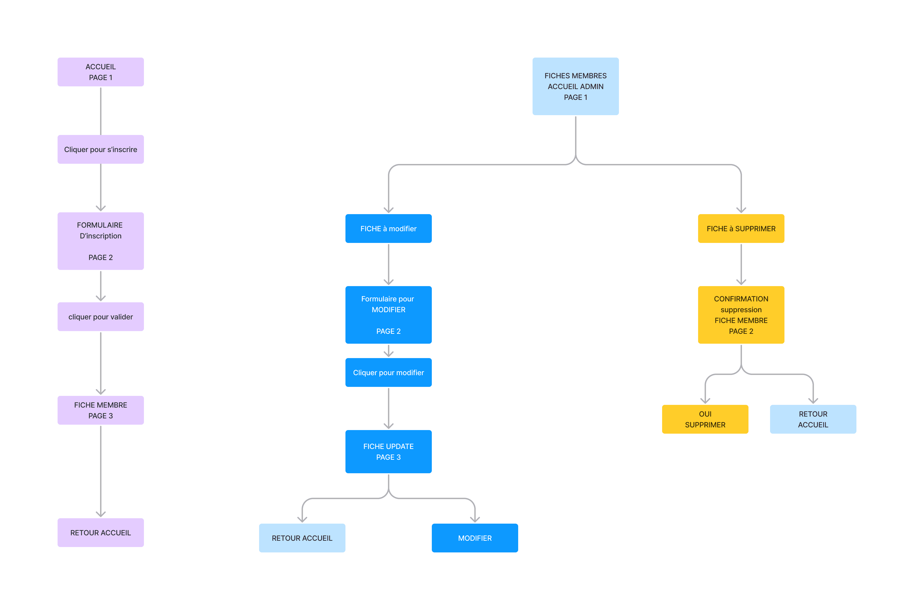

[lien du site](https://laetitiamichel.github.io/PHP_PROJET_BTS/)
---
# MAQUETTE GRAPHIQUE:


## Création du logo:

## Création des formulaires:


---

- [ ] [maquette](https://www.figma.com/file/LxHTDDICYGSV2WcVPr34Oa/MAQUETTE-GRAPHIQUE-MAISON-LIGUES?type=whiteboard&node-id=0-1&t=E7Gmwt2ZpKqrVJUz-0)

# Création du MCD:
```
CLIENTS: id_membre, nom, prenom, age, ville, e-mail,image

PUBLIER, 11 EVENEMENT, 0N CLIENTS

EVENEMENT: id_even, nom, desc, date_creation, date_modification, image
```


# Arbre euristique:

